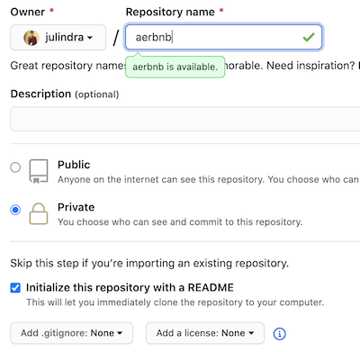
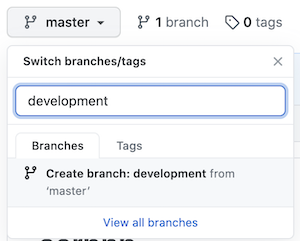
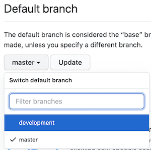
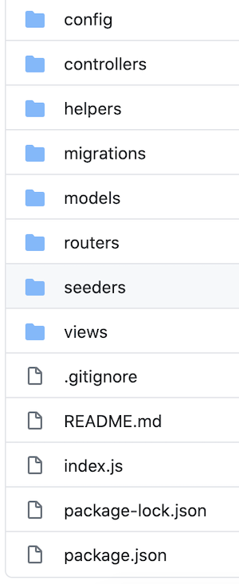
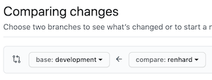
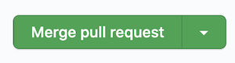
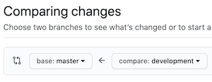
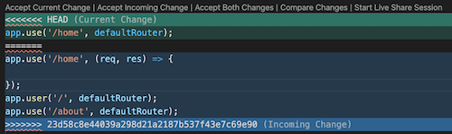

# pair-project-101

## initialization
1. Buatlah public/private repository baru
2. Centang initialize readme option  
	
3. Buat branch baru bernama `development` dari branch `master`  
	
4. Buka settings - branches dan ubah default branch menjadi `development`  
	
5. Buka settings - manage access dan invite teman pair dan instruktur  
	
6. Clone repository, inisialisasi project structure & file minimum untuk memulai project, kemudian push ke `development`  
	

## work
1. Setelah intialization selesai, masing-masing individu dapat membuat branch baru sesuai keinginan dari branch `development`
	```
	git status //pastikan on branch development
	git checkout -b 'newbranchname'
	```
	**note:** idealnya setiap fitur/modul dibuat pada branch masing-masing, namun apabila belum terbiasa, gunakan 1 branch saja untuk masing-masing individu (jika team terdiri dari 2 orang maka ada 4 branch: `master`, `development`, `person1`, `person2`)
2. Jalankan `git pull origin development` untuk membuat branch uptodate dengan `development`
3. Lakukan pengerjaan project pada branch. Jika sudah ada fitur/modul/bagian yang selesai, lakukan push ke branch
	```
	git push origin newbranchname
	```
4. Untuk membuat fitur/modul/bagian yang telah dipush masuk ke `development`, buatlah pull request dengan melakukan `compare: newbranchname`  
	
5. Pilih `Merge pull request` untuk menggabungkan fitur/modul/bagian ke `development`. Setelah merge, `development` memiliki fitur/modul/bagian yang tadi dikerjakan di branch  
	
6. Ulangi step 2-5
7. Jika pengerjaan sudah selesai, sudah dimerge ke `development` semua dan siap untuk dirilis, buatlah pull request dengan melakukan `compare: development` ke `base: master`. Setelah itu lakukan `Merge pull request`  
	

## faq
**Q1:** Setelah membuat branch sendiri dan mencoba menjalankan project, saya mendapatkan `Error: Cannot find module`, apakah saya harus menginstall module satu per satu lagi?  
**A1:** Tidak, apabila sudah terdapat file `package.json` dan terdapat `dependencies`, maka cukup lakukan `npm install` (tanpa argumen lain)

**Q2:** Bagaimana agar teman pair saya pada branchnya sendiri bisa mendapatkan update dari yang telah saya kerjakan?  
**A2:** Apabila kamu sudah melakukan merge pull request ke `development`, maka teman pair kamu cukup lakukan `git pull origin development` untuk mendapatkan update terbaru dari branch `development`

**Q3:** Ketika saya melakukan `git pull origin development`, saya mendapatkan message `CONFLICT` dan `Automatic merge failed`, apa yang harus saya lakukan?  
**A3:** Conflict biasanya terjadi ketika 2 branch melakukan perubahan pada line dan file yang sama. Ketika terjadi conflict, VS Code akan memberikan warna merah pada setiap file yang conflict dan menunjukkan line mana yang conflict.  
	  
Yang perlu dilakukan adalah memperbaiki conflict tersebut dengan menentukan kode mana yang benar dan ingin digunakan. Setelah itu, lakukan `git add` dan `git commit`

**Q4:** Saya tidak bisa menekan button `Merge pull request` dan dikatakan `This branch has conflicts that must be resolved`, apa yang harus saya lakukan?  
**A4:** Jalankan `git pull origin development` dari branch yang ingin dimerge, kemudian selesaikan conflict seperti pada *A3* dan lakukan push ke branch tersebut. Setelah menyelesaikan conflict dan push seharusnya button `Merge pull request` dapat ditekan

**Q5:** Jika saya sudah melakukan merge `development` ke `master`, bagaimana saya melakukan deploy Heroku?  
**A5:** Jika `master` sudah ready untuk dirilis, maka lakukan terlebih dahulu
```
git checkout master
git pull origin master
```
agar branch `master` pada local menjadi uptodate, setelah itu lakukan langkah-langkah untuk deploy Heroku

## interactive tutorial
- [https://learngitbranching.js.org/](https://learngitbranching.js.org/)